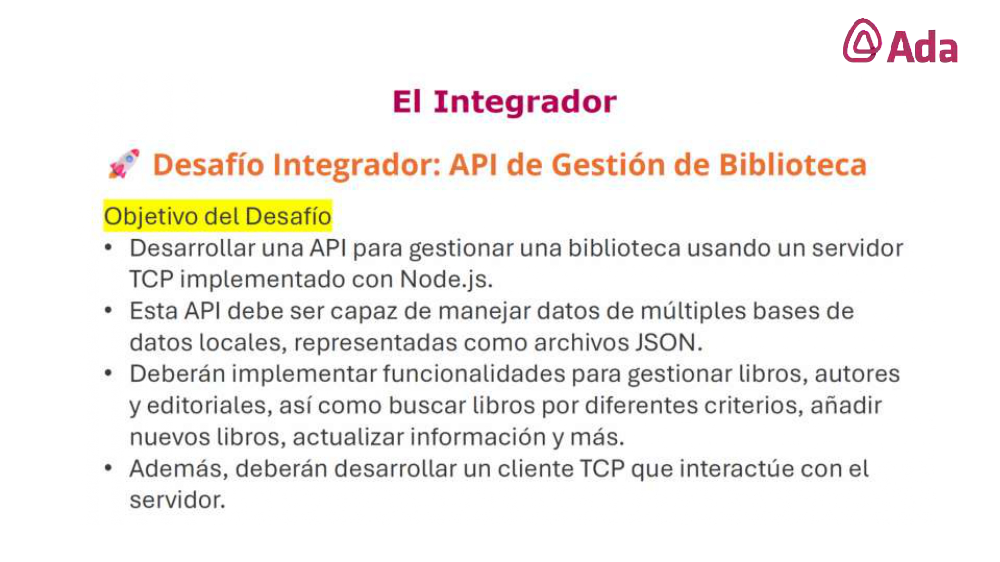

# Desafío Integrador: API de Gestión de Biblioteca

## Objetivo

## Configuaración del proyecto

## Estructura y modularización

## Manejo de datos

## Implementación servidor TCP

## Desarrollo del cliente TCP

## Gestión de autores y editoriales

## Pruebas y manejo de errores

## Documentación y presentación

## Estructura MVC

